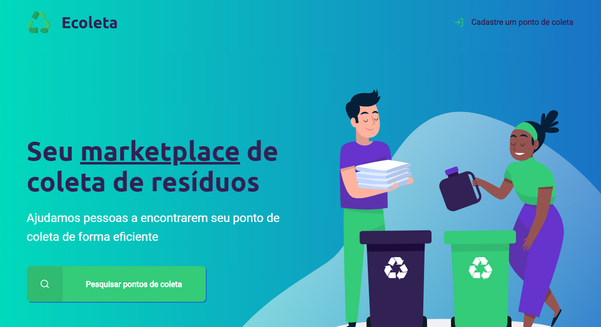
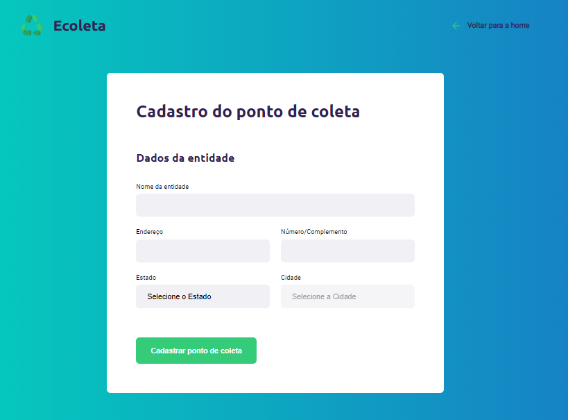
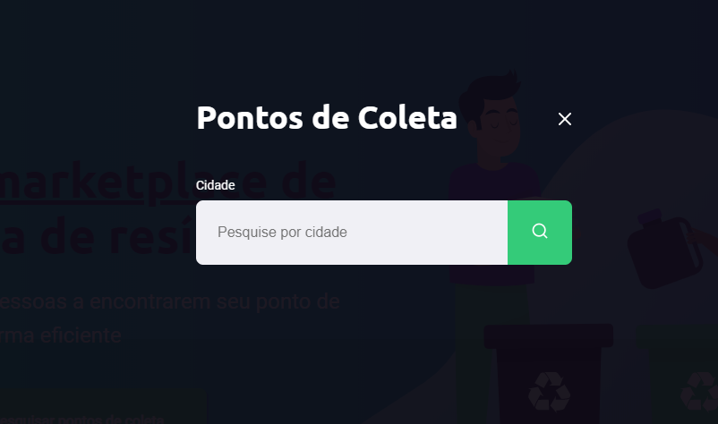
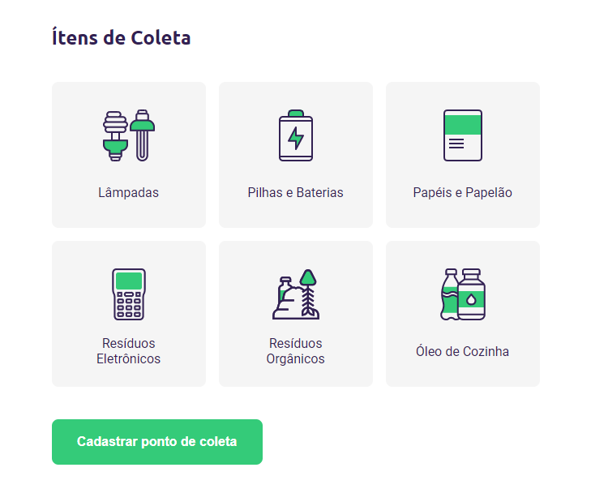
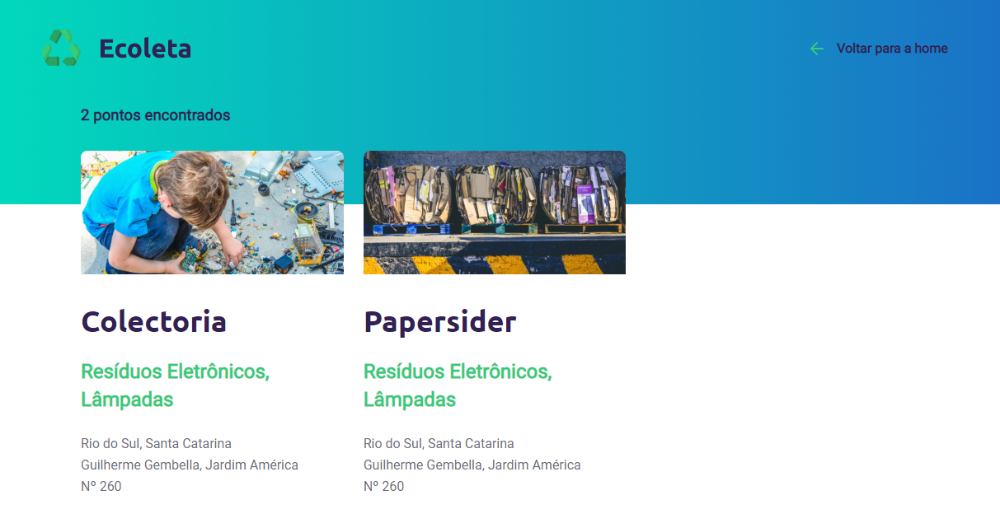

<h1>
 
</h1>

# 📄 Sobre

 Um projeto produzido na **Next Level Week** da Rocketseat (version: starter) com algumas atualizações e mudanças pessoais para aprimorar o projeto.

 # Tecnologias usadas:
 - HTML
 - CSS
 - JavaScript
 - SQL
 - Node.js

 Tecnologiais recomendadas para Desenvolvimento WEB tanto Front-end como Back-end para iniciantes by Rocketseat.

 # Desenvolvimento do Projeto

## Dia 1  
- index.html 
- styles 
- assets

 

## Dia 2  
 - Adicionando JS e Formulario ao projeto
 - Atualização na Responsividade (1.0)

 

## Dia 3
- Adicionado **modal** da página principal
- Adicionado **Ítens de Coleta** da página de cadastro
- Adicionado **search-results** 

 
  
  

## Dia 4

- Adicionando **Node.js** ao projeto 
- Adicionando **.json**
- Atualização na organização de pastas (Sem a quebra de conteúdos)
- Adicionando **server.js** e localhost
- Mudanças no Design do layout 

## Dia 5 

- Desenvolvendo o servidor back-end
- SQL e DataBase 
- Atualização de conteúdos
- Adicionado Sistema de implementação de "Points"  

# Final do Projeto Principal

O projeto principal chegou ao seu fim, mas outra implementações pessoais feitas por mim vão ser feitas, aguardem...